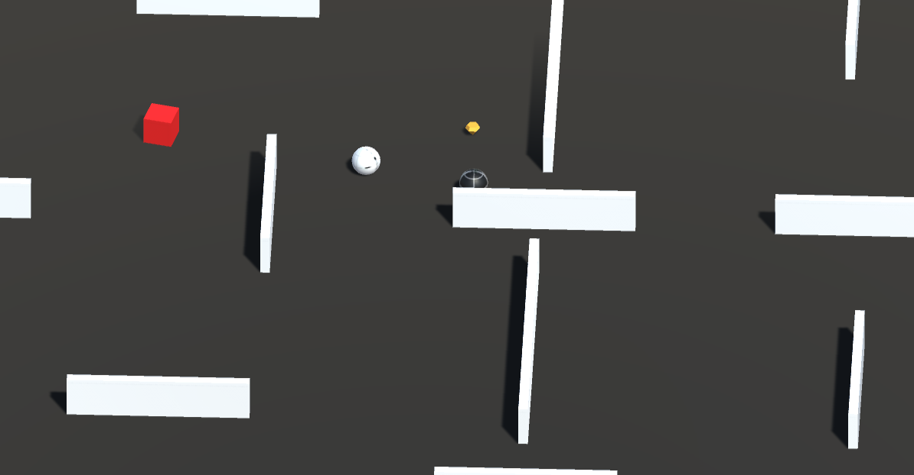

# 🎮 Survival Ball

Dodge, roll, and outsmart relentless enemy balls in **Survival Ball** — a fast-paced arcade survival game where one ball fights to stay alive. How long can you last?

---

## 🕹️ How to Play

- 🎛️ **Move Forward & Backward:** `Up` and `Down` arrow keys
- 🔄 **Rotate Scene:** `Left` and `Right` arrow keys
- ⏱️ **Survive as long as possible without falling off the edges!**

---

## ⚠️ Rules & Features

- ❌ **Avoid touching the red cube** — one hit and it's game over.
- 📈 **Enemies increase** each time they fall off the platform.
- 🍬 **Collect the orange Jewelry** for temporary power — push enemies off the edge!

---

## ✨ Game Features

- 🕹️ Smooth ball controls with responsive physics
- ⏱️ Real-time increasing difficulty
- 🍬 Temporary power-up assets
- 🧠 **AI-driven enemy movement** using a smart **A\*** pathfinding algorithm follow the player
- 🔄 Scene rotation mechanics for unique navigation

---

## 📸 Preview

---

## 🚀 Play Online

👉 [**Start Playing Survival Ball Now!**](https://zeyad-mohamed-hammad.itch.io/survival-ball?secret=CD6dJryIy726zKoP6UYyyC2k)
